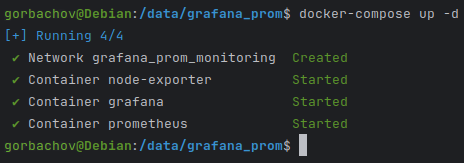
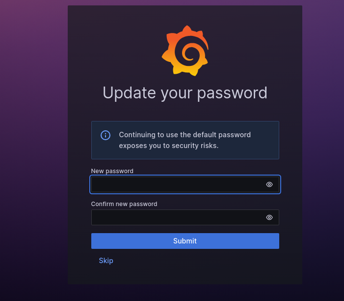
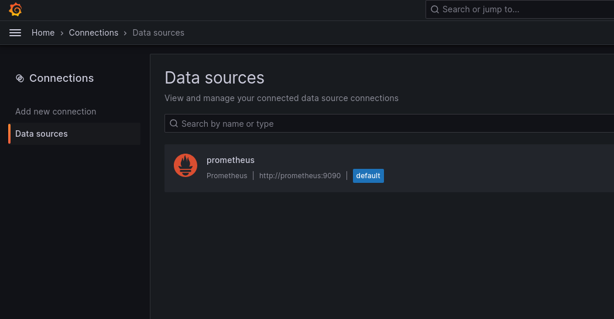
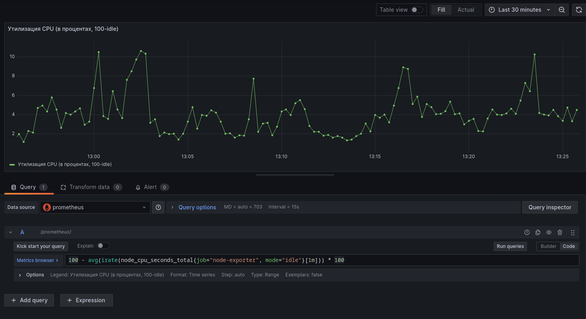
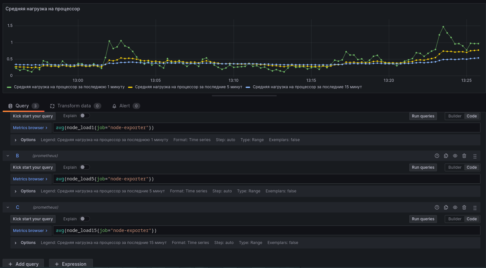
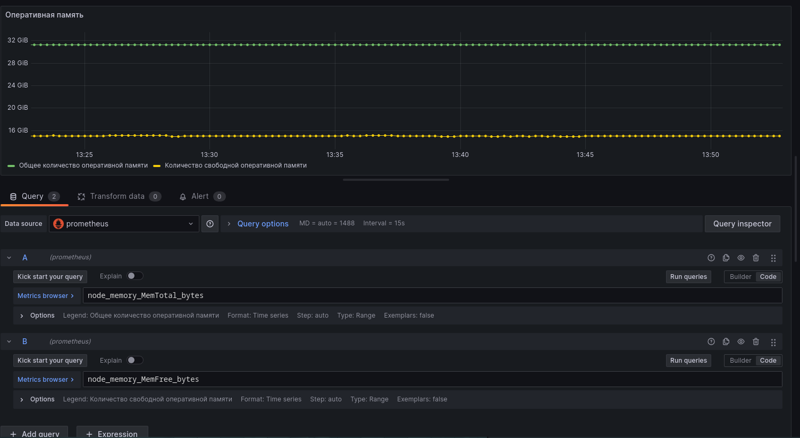
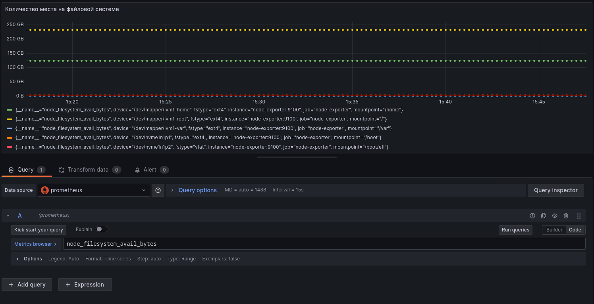
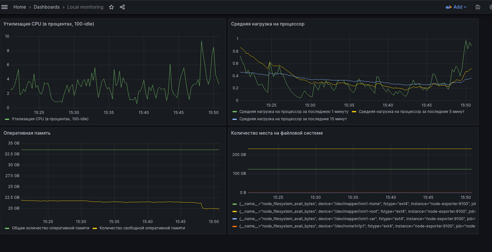
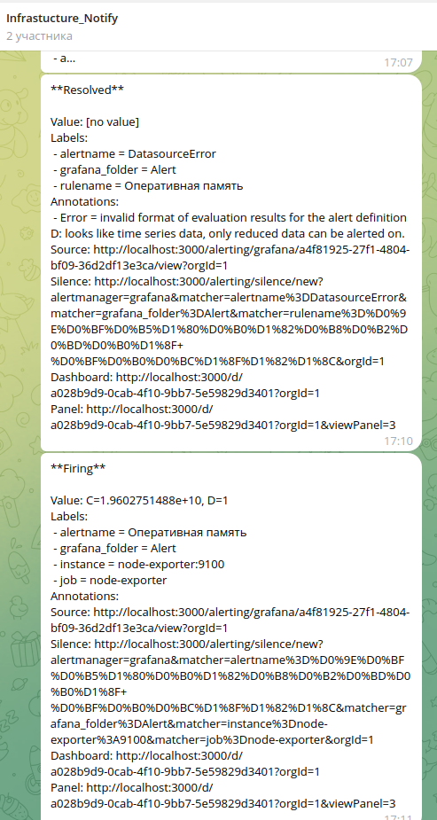

# Домашнее задание к занятию «Средство визуализации Grafana» - `Горбачёв Олег`

## Задание повышенной сложности

**При решении задания 1** не используйте директорию [help](./help) для сборки проекта. Самостоятельно разверните grafana, где в роли источника данных будет выступать prometheus, а сборщиком данных будет node-exporter:

- grafana;
- prometheus-server;
- prometheus node-exporter.

За дополнительными материалами можете обратиться в официальную документацию grafana и prometheus.

В решении к домашнему заданию также приведите все конфигурации, скрипты, манифесты, которые вы 
использовали в процессе решения задания.

**При решении задания 3** вы должны самостоятельно завести удобный для вас канал нотификации, например, Telegram или email, и отправить туда тестовые события.

В решении приведите скриншоты тестовых событий из каналов нотификаций.

## Обязательные задания

## Задание 1

1. Используя директорию [help](./help) внутри этого домашнего задания, запустите связку prometheus-grafana.
2. Зайдите в веб-интерфейс grafana, используя авторизационные данные, указанные в манифесте docker-compose.
3. Подключите поднятый вами prometheus, как источник данных.
4. Решение домашнего задания — скриншот веб-интерфейса grafana со списком подключенных Datasource.

## Задание 2

Изучите самостоятельно ресурсы:

1. [PromQL tutorial for beginners and humans](https://valyala.medium.com/promql-tutorial-for-beginners-9ab455142085).
2. [Understanding Machine CPU usage](https://www.robustperception.io/understanding-machine-cpu-usage).
3. [Introduction to PromQL, the Prometheus query language](https://grafana.com/blog/2020/02/04/introduction-to-promql-the-prometheus-query-language/).

Создайте Dashboard и в ней создайте Panels:

- утилизация CPU для nodeexporter (в процентах, 100-idle);
- CPULA 1/5/15;
- количество свободной оперативной памяти;
- количество места на файловой системе.

Для решения этого задания приведите promql-запросы для выдачи этих метрик, а также скриншот получившейся Dashboard.

## Задание 3

1. Создайте для каждой Dashboard подходящее правило alert — можно обратиться к первой лекции в блоке «Мониторинг».
2. В качестве решения задания приведите скриншот вашей итоговой Dashboard.

## Задание 4

1. Сохраните ваш Dashboard. Для этого перейдите в настройки Dashboard, выберите в боковом меню «JSON MODEL». Далее скопируйте отображаемое json-содержимое в отдельный файл и сохраните его.
2. В качестве решения задания приведите листинг этого файла.

---

## Решение обязательного задания

## Решение 1

1. Самостоятельно, используя docker-compose, развернул grafana, prometheus и node-exporter:



Все конфигурации, скрипты, манифесты, которые я использовал в процессе решения задания доступны по ссылке: https://github.com/DemoniumBlack/fedorchukds-devops-33-28/tree/main/SRC/grafana_prom

2. Зашел в web-интерфейс Grafana. По умолчанию логин и пароль admin/admin, но при первом входе предлагается изменить пароль, т.к. я явно не указывал логин и пароль в переменных docker-compose файла:



3. Подключил Prometheus как источник данных.

4. Скриншот Data sources:



## Решение 2

Создал Dashboard c панелями:
- утилизация CPU для node-exporter (в процентах, 100-idle):
```text
100 - avg(irate(node_cpu_seconds_total{job="node-exporter", mode="idle"}[1m])) * 100
```
Скриншот:


- CPULA 1/5/15:
```text
avg(node_load1{job="node-exporter"})
avg(node_load5{job="node-exporter"})
avg(node_load15{job="node-exporter"})
```
Скриншот:


- количество свободной оперативной памяти:
```text
node_memory_MemFree_bytes
```
Скриншот:


- количество места на файловой системе:
```text
node_filesystem_avail_bytes
```
Скриншот:


Общий скриншот Dashboard:



## Решение 3

Для панелей созданного ранее Dashboard настроил алертинг. Алерты отправляются в Telegram канал.

Пример оповещения в Telegram канале:



В итоге Dashboard выглядит следующим образом:


## Решение 4

1. Сохранил Dashboard в json файл.

2. Ссылка на файл: https://github.com/DemoniumBlack/fedorchukds-devops-33-28/blob/main/SRC/Dashboard/dashboard.json

---
